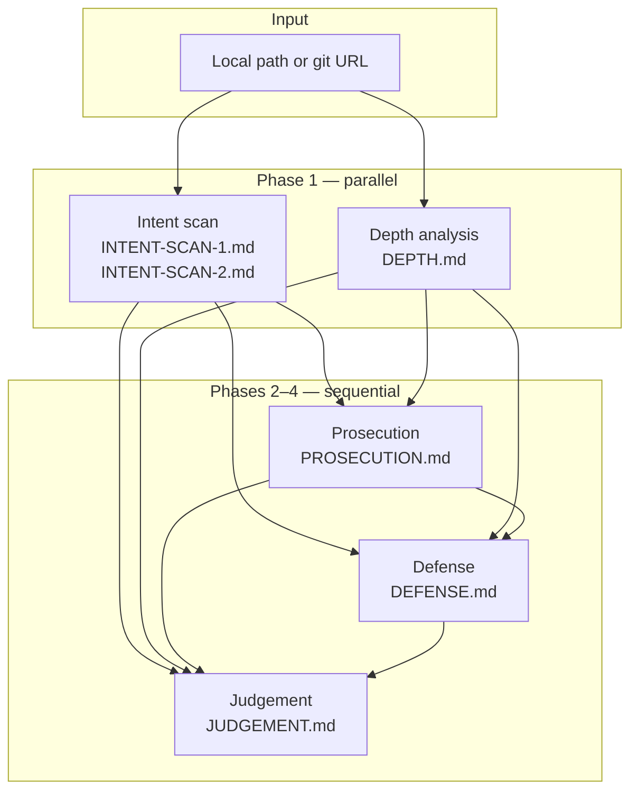

# middleton

> *"is this legit?" Analysis Workflow

> [!NOTE]
> The name `middleton`, comes from the excellent Judge Jeffery Middleton in St.
> Joseph County Michigan, who streams his courtroom ocassionally. While not much
> of a "theater" trial court (like this codebase puts on), a good show either way:
> [Youtube Channel](https://www.youtube.com/channel/UCS8gM5S889oBPyN6K07ZC6A/streams)

**middleton** is a Rust CLI that runs a structured, multi-phase review of a git
repository or local directory. It uses [OpenCode](https://opencode.ai) or
[Claude Code](https://docs.anthropic.com/en/docs/claude-code) agents to examine
an artifact corpus — code, docs, proofs, CI, papers — and produce a trial-style
analysis: adversarial prosecution, charitable defense, and a middle-ground
legitimacy verdict.

The goal is not a conventional code review. Middleton asks
**whether a repository is substantive or performative**: hollow scaffolding
versus tangible engineering, stagecraft versus sincerity, claims backed by
implementation versus narrative hype.

> [!WARNING]
> **Clanker generated code.**

> [!IMPORTANT]
> Published because people like seeing the results, and I want them to
> burn their own tokens. Not really tested much. I would rather build
> a custom agent for this, but wanted to hand off the process to folks.
>
> Prompt editing is expected, depending on what you're looking at.

## Requirements

- **Rust** toolchain (2024 edition; build with `cargo build --release`)
- **One agent backend:**
  - **OpenCode** (default): `opencode` on your `PATH` and **`OPENCODE_API_KEY`**
    (OpenCode Go / `opencode-go`, not OpenCode Zen)
  - **Claude Code**: `claude` on your `PATH` with Claude Code authentication
    configured
- **pandoc** on your `PATH` for PDF export (or pass `--skip-pdf` to skip)
- **PDF engine**: **xelatex** recommended; middleton falls back to **pdflatex**
  if xelatex is unavailable

## How it works

Middleton runs five analysis phases against the target directory using either
OpenCode or Claude Code. Each phase uses a plan → build workflow: the agent plans
its analysis, then writes structured markdown artifacts under `.middleton/`.
Analysis is **read-only** — middleton rejects execution permissions (bash,
compile, run, etc.) and only allows writes under `.middleton/` during the build
step.

Session IDs are recorded in `.middleton/sessions.json` so you can resume or
inspect individual phases later.



### Phases

| Phase | Reads | Writes | Role |
|-------|-------|--------|------|
| **Intent** | Repository (docs + code, read-only) | `INTENT-SCAN-1.md`, `INTENT-SCAN-2.md` | Forensic scan for rhetorical intent, stagecraft, and performative signals |
| **Depth** | Repository (independent; ignores `.middleton/`) | `DEPTH.md` | Assesses hollow vs. tangible substance — CI, proofs, papers, code quality |
| **Prosecution** | Intent scans + depth | `PROSECUTION.md` | Adversarial brief: psychological profiling, mythos, publishing intent |
| **Defense** | Intent scans + depth + prosecution | `DEFENSE.md` | Charitable rebuttal with the same structure as prosecution |
| **Judgement** | All prior artifacts | `JUDGEMENT.md` | Middle-ground synthesis and a committed legitimacy verdict |

## Install

```bash
cargo build --release
```

The binary is written to `target/release/middleton`.

## Usage

Review a local directory with OpenCode:

```bash
export OPENCODE_API_KEY=your-key-here
middleton /path/to/repo
```

Review with Claude Code instead:

```bash
middleton /path/to/repo --agent claudecode --model sonnet
```

Clone and review a git repository (defaults to `./<repo-name>` in the current directory):

```bash
middleton https://github.com/org/some-repo.git --note "Fork submitted for an internal security review."
```

Clone to a specific directory:

```bash
middleton https://github.com/org/some-repo.git --output /tmp/some-repo
```

Export PDFs for an existing `.middleton` directory, skipping files that already
have a matching `.pdf`:

```bash
middleton --export-pdf /path/to/repo/.middleton
```

### Options

| Flag | Default | Description |
|------|---------|-------------|
| `--output`, `-o` | `./<repo-name>` | Clone destination when input is a git URL |
| `--agent` | `opencode` | Agent backend: `opencode` or `claudecode` |
| `--model` | `kimi-k2.5` | OpenCode Go catalog model id, or `sonnet` / `opus` / `haiku` for Claude Code |
| `--hostname` | `127.0.0.1` | OpenCode server bind hostname |
| `--opencode` | `opencode` | Path to the OpenCode binary |
| `--claude` | `claude` | Path to the Claude Code binary |
| `--log-level` | `info` | Log filter (`RUST_LOG`-style; overridden by `RUST_LOG` if set) |
| `--pandoc` | `pandoc` | Pandoc binary used for PDF export |
| `--skip-pdf` | — | Skip pandoc PDF export at the end |
| `--export-pdf` | — | Export only markdown files in `DIR` that do not yet have a `.pdf` (skips the trial pipeline) |
| `--note` | — | Additional context prepended to all analysis prompts |

## Output

All artifacts are written to `<target>/.middleton/`:

```text
.middleton/
├── INTENT-SCAN-1.md    # Documentation-layer intent scan
├── INTENT-SCAN-2.md    # Full-codebase intent scan
├── DEPTH.md            # Hollow vs. tangible substance analysis
├── PROSECUTION.md      # Adversarial brief
├── DEFENSE.md          # Charitable brief
├── JUDGEMENT.md        # Middle-ground legitimacy verdict
├── sessions.json       # Session IDs per phase
├── INTENT-SCAN-1.pdf   # Styled PDF export (and matching PDFs for each .md)
├── ...
```

After the pipeline completes, middleton runs **pandoc** on every `.md` file in
`.middleton/` and writes a matching `.pdf` with numbered sections, a table of
contents, syntax highlighting, and a styled header/footer.

The target repository itself is not modified beyond the `.middleton/` directory.

## License

MIT — see [LICENSE](LICENSE).
