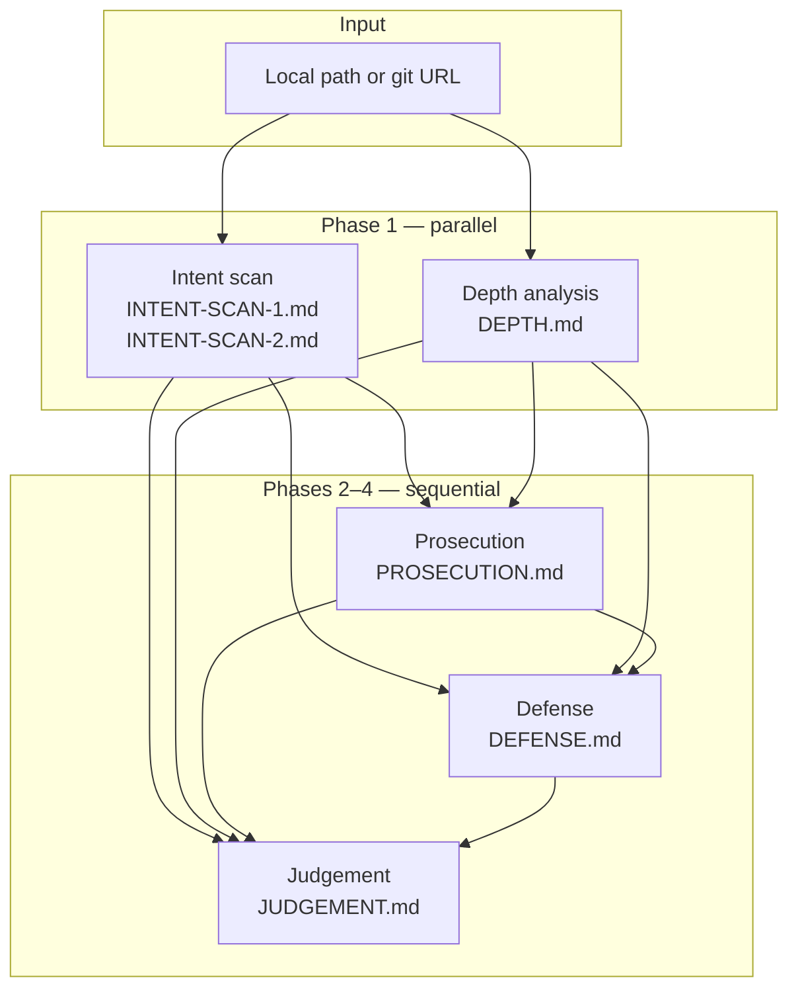

# middleton

> *"is this legit?" Analysis Workflow

> [!NOTE]
> The name `middleton`, comes from the excellent Judge Jeffery Middleton in St.
> Joseph County Michigan, who streams his courtroom ocassionally. While not much
> of a "theater" trial court (like this codebase puts on), a good show either way:
> [Youtube Channel](https://www.youtube.com/channel/UCS8gM5S889oBPyN6K07ZC6A/streams)

`middleton` is a Rust CLI that runs a structured, multi-phase review of a git
repository or local directory. It uses [OpenCode](https://opencode.ai),
[Claude Code](https://docs.anthropic.com/en/docs/claude-code), or
[Codex](https://github.com/openai/codex) agents to examine
an artifact corpus — code, docs, proofs, CI, papers — and produce a trial-style
analysis: adversarial prosecution, charitable defense, and a middle-ground
legitimacy verdict.

The goal is not a conventional code review. Middleton asks
whether a repository is **substantive or performative**: hollow scaffolding
versus tangible engineering, stagecraft versus sincerity, claims backed by
implementation versus narrative hype.

> [!WARNING]
> **Clanker generated code.**

> [!IMPORTANT]
> Published because people like seeing the results, and I want them to
> burn their own tokens. Not really tested much. I would rather build
> a custom agent for this, but wanted to hand off the process to folks.
>
> Prompt editing is expected, depending on what you're looking at.

## Requirements

> [!WARNING]
> **Codex** and **Claude Code** support is questionable compared to **OpenCode**.
> OpenCode is the default and best-tested backend.

- **Rust** toolchain (2024 edition; build with `cargo build --release`)
- **One agent backend:**
  - **OpenCode** (default): `opencode` on your `PATH` and **`OPENCODE_API_KEY`**
    (OpenCode Go / `opencode-go`, not OpenCode Zen)
  - **Claude**: `claude` on your `PATH` with authentication configured
  - **Codex**: `codex` on your `PATH` with Codex authentication configured
- **PDF export** (optional; `--skip-pdf` to skip): **pandoc** and **xelatex**
  (falls back to **pdflatex**). Body text uses **DejaVu Sans** for broad symbol
  coverage in agent-generated prose. On Ubuntu:

  ```bash
  sudo apt install pandoc texlive-xetex texlive-latex-recommended \
    texlive-latex-extra texlive-fonts-recommended fonts-dejavu fonts-lmodern
  ```

  Debian: see [`Dockerfile`](Dockerfile) (`runtime-base` apt/CTAN setup).
- **eBook export (EPUB3)** (optional; `--skip-epub` to skip): **pandoc** only (no
  TeX). **`fonts-dejavu`** is recommended so embedded typography matches the
  styled export. Independent of PDF — you can export EPUB without installing
  xelatex.

## How it works

Middleton runs five analysis phases against the target directory using either
OpenCode, Claude Code, or Codex. Each phase uses a plan → build workflow: the
agent plans its analysis, then writes structured markdown artifacts under
`.middleton/<agent>/` (for example `.middleton/opencode/` or
`.middleton/claude/`), so outcomes from different agent backends stay
separate. Analysis is **read-only** for the target corpus: the agent may use
read-only git history and guarded web search **during the plan step only** (when
the backend supports it), then transcribes findings during build. Middleton
rejects installs, builds, tests, and target-corpus writes; build steps may only
write under `.middleton/<agent>/`.

Session IDs are recorded in `.middleton/<agent>/sessions.json` so you can resume
or inspect individual phases later.



### Review profiles

Use `--profile` to choose the corpus lens (default `repository`):

| Profile | Use when |
|---------|----------|
| `repository` | Git repos with code, CI, proofs, and docs — assess implementation vs claims |
| `documents` | Specs, architecture packs, or design folders with little or no code — rigorous doc evaluation without penalizing missing source |

Both profiles run the same five phases and write the same artifact filenames.
`INTENT-SCAN-2` means full-codebase signals in `repository` mode and
cross-document structure/coherence in `documents` mode.

### Phases

| Phase | Reads | Writes | Role |
|-------|-------|--------|------|
| **Intent** | Corpus (read-only; scope depends on profile) | `INTENT-SCAN-1.md`, `INTENT-SCAN-2.md` | Forensic scan for rhetorical intent, stagecraft, and performative signals |
| **Depth** | Corpus (independent; ignores `.middleton/`) | `DEPTH.md` | Hollow vs. tangible substance (code/CI in `repository`; doc coherence in `documents`) |
| **Prosecution** | Intent scans + depth | `PROSECUTION.md` | Adversarial brief: psychological profiling, mythos, publishing intent |
| **Defense** | Intent scans + depth + prosecution | `DEFENSE.md` | Charitable rebuttal with the same structure as prosecution |
| **Judgement** | All prior artifacts | `JUDGEMENT.md` | Middle-ground synthesis and a committed legitimacy verdict |

## Install

```bash
cargo build --release
```

The binary is written to `target/release/middleton`.

## Docker

> [!WARNING]
> Docker images and `compose.yaml` are **not fully tested** — not in CI, and not
> manually across every agent platform. We don't hold accounts on all backends and
> wouldn't pay to run full end-to-end trials against each one. Treat this path as
> experimental; expect breakage.

Images bundle the `middleton` binary, pandoc/TeX for PDF export, pandoc/fonts
for EPUB3 export, and one agent backend per runtime target. See
[`Dockerfile`](Dockerfile) for build stages and [`compose.yaml`](compose.yaml)
for service definitions.

### Build

Plain `docker build` produces the **OpenCode** runtime (default target):

```bash
docker build -t middleton:opencode .
```

Other agent runtimes:

```bash
docker build --target codex-runtime -t middleton:codex .
docker build --target claude-runtime -t middleton:claude .
```

Overridable build args include `RUST_VERSION` (default `1.96.0`),
`DEBIAN_VERSION` (default `trixie`), `OPENCODE_VERSION` (default `v1.15.12`),
`CODEX_VERSION` (default `0.135.0`), and `CLAUDE_VERSION` (default `stable`).

### Compose

Three services map to the three runtime targets. The intended workflow is
`docker compose run`:

```bash
cp .env.opencode.token.example .env.opencode.token
# edit .env.opencode.token — set OPENCODE_API_KEY

docker compose run --rm middleton-opencode /workspace/my-repo
docker compose run --rm middleton-codex https://github.com/org/repo.git
docker compose run --rm middleton-claude /workspace/my-repo --model sonnet
```

Build args from the Dockerfile can be overridden in a root `.env` file (or the
shell environment) when running `docker compose build`:

| Variable | Default | Used by |
|----------|---------|---------|
| `RUST_VERSION` | `1.96.0` | all services |
| `DEBIAN_VERSION` | `trixie` | all services |
| `OPENCODE_VERSION` | `v1.15.12` | `middleton-opencode` |
| `CODEX_VERSION` | `0.135.0` | `middleton-codex` |
| `CLAUDE_VERSION` | `stable` | `middleton-claude` |

Token files (git-ignored):

| File | Variable |
|------|----------|
| `.env.opencode.token` | `OPENCODE_API_KEY` |
| `.env.codex.token` | `OPENAI_API_KEY` |
| `.env.claude.token` | `ANTHROPIC_API_KEY` |

Persistent storage defaults to the `middleton-data` named volume mounted at
`/workspace`. Override with a host path via `MIDDLETON_STORAGE` in a root
`.env` file (for example `MIDDLETON_STORAGE=./data`).

## Usage

Review a local directory with OpenCode:

```bash
export OPENCODE_API_KEY=your-key-here
middleton /path/to/repo
```

Review with Claude instead:

```bash
middleton /path/to/repo --agent claude --model sonnet
```

Review with Codex instead:

```bash
middleton /path/to/repo --agent codex
```

Review a specification or design document pack (no code penalty):

```bash
middleton /path/to/architecture-pack --profile documents
```

Clone and review a git repository (defaults to `./<repo-name>` in the current directory):

```bash
middleton https://github.com/org/some-repo.git --note "Fork submitted for an internal security review."
```

Clone to a specific directory:

```bash
middleton https://github.com/org/some-repo.git --output /tmp/some-repo
```

Export PDFs for an existing agent artifact directory, skipping files that already
have a matching `.pdf`:

```bash
middleton --export-pdf /path/to/repo/.middleton/opencode
```

Export EPUBs for an existing agent artifact directory, skipping files that already
have a matching `.epub`:

```bash
middleton --export-epub /path/to/repo/.middleton/opencode
```

### Options

| Flag | Default | Description |
|------|---------|-------------|
| `--output`, `-o` | `./<repo-name>` | Clone destination when input is a git URL |
| `--agent` | `opencode` | Agent backend: `opencode`, `claude`, or `codex` |
| `--model` | `kimi-k2.5` | OpenCode Go catalog model id, `sonnet` / `opus` / `haiku` for Claude, or a Codex model id |
| `--hostname` | `127.0.0.1` | OpenCode server bind hostname |
| `--opencode` | `opencode` | Path to the OpenCode binary |
| `--claude` | `claude` | Path to the Claude binary |
| `--codex` | `codex` | Path to the Codex CLI binary |
| `--log-level` | `info` | Log filter (`RUST_LOG`-style; overridden by `RUST_LOG` if set) |
| `--pandoc` | `pandoc` | Pandoc binary used for PDF and EPUB export |
| `--skip-pdf` | — | Skip pandoc PDF export at the end |
| `--skip-epub` | — | Skip pandoc EPUB export at the end |
| `--export-pdf` | — | Export only markdown files in `DIR` that do not yet have a `.pdf` (skips the trial pipeline) |
| `--export-epub` | — | Export only markdown files in `DIR` that do not yet have a `.epub` (skips the trial pipeline) |
| `--note` | — | Additional context prepended to all analysis prompts |
| `--profile` | `repository` | Corpus lens: `repository` or `documents` |

### Plan vs build and agent backends

During the **plan** step, agents may optionally use read-only `git` commands and
guarded web search/fetch to corroborate external claims; prompts require labeling
those findings as external context. During **build**, agents only write
`.middleton/<agent>/` markdown from the completed plan — no new investigation.

| Backend | `repository` plan step | `documents` plan step |
|---------|----------------------|----------------------|
| OpenCode | File reads + bash/git + web | File reads + web only |
| Claude | Reads + `Bash` + `WebSearch`/`WebFetch` | Reads + web tools; `Bash` disallowed |
| Codex | Network on; shell accepted in plan | Network on; shell declined in plan |

Build steps for both profiles: file reads and `.middleton/` writes only — no shell,
git, or web.

Middleton auto-answers tool permission prompts, user-input questions, and Codex
approval requests so Claude and Codex runs do not block waiting for a human
in the terminal.

Each run appends to `.middleton/<agent>/actions.log`: run timestamp, CLI
options, target path, and every action middleton confirmed on your behalf (also
logged at `info` level).

## Output

All artifacts are written to `<target>/.middleton/<agent>/`:

```text
.middleton/
└── opencode/              # or claude/, codex/, etc.
    ├── INTENT-SCAN-1.md    # Documentation-layer intent scan
    ├── INTENT-SCAN-2.md    # Codebase or cross-document intent scan (profile-dependent)
    ├── DEPTH.md            # Hollow vs. tangible substance analysis
    ├── PROSECUTION.md      # Adversarial brief
    ├── DEFENSE.md          # Charitable brief
    ├── JUDGEMENT.md        # Middle-ground legitimacy verdict
    ├── TRIAL.md            # Consolidated record (generated at end)
    ├── TRIAL.pdf           # Consolidated PDF (unless --skip-pdf)
    ├── TRIAL.epub          # Consolidated EPUB (unless --skip-epub)
    ├── sessions.json       # Session IDs per phase
    ├── INTENT-SCAN-1.pdf   # Styled PDF export (and matching PDFs for each .md)
    ├── INTENT-SCAN-1.epub  # Styled EPUB export (and matching EPUBs for each .md)
    └── ...
```

After the pipeline completes, middleton writes **`TRIAL.md`** by merging the phase
reports in this order: Judgement, Prosecution, Defense, Depth, then any other
markdown artifacts (for example the intent scans). Each source file is kept;
`TRIAL.md` is an additional single-file outcome.

Unless `--skip-pdf` is set, middleton then runs **pandoc** on every phase `.md`
file and on `TRIAL.md`, writing matching `.pdf` files with numbered sections, a
table of contents, syntax highlighting, and a styled header/footer.

Unless `--skip-epub` is set, middleton runs **pandoc** on the same markdown files,
writing matching `.epub` files (EPUB3) with the same structure and middleton
branding. Export pre-processes agent markdown before pandoc: standalone `---`
horizontal-rule lines are rewritten so they are not parsed as YAML; legacy
`* **A)**` quiz-style bullets are normalized to lettered lists; metadata (`title`,
`author`, `lang`) is set via the pandoc CLI, not YAML front matter in the reports.

The target repository itself is not modified beyond the `.middleton/<agent>/`
directory.

## License

MIT — see [LICENSE](LICENSE).
